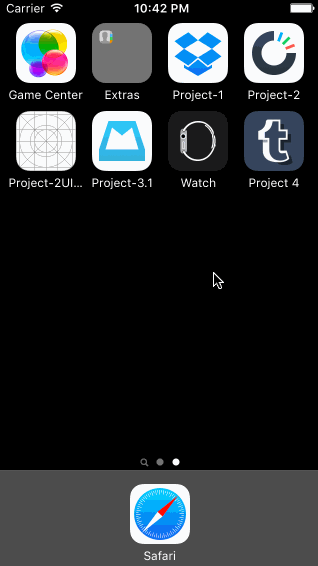

# Assignment 4: Tumblr

The purpose of this homework is to leverage animations and gestures to create custom navigation. We're going to use the techniques from this week to implement some interactions in Tumblr.

Time: I spent around 6-7 hours on the exercise

Walkthrough of all the project stories:

The GIF was created with [LiceCap](http://www.cockos.com/licecap/).